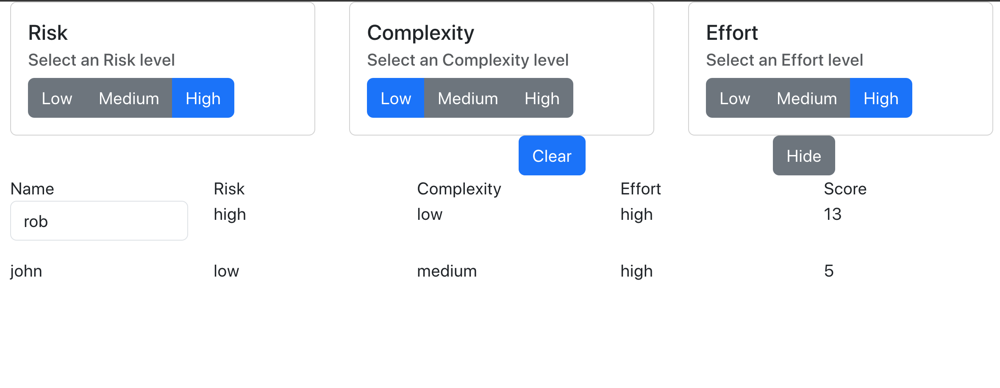

# Background

Provides a scrum poker like board for folks to estimate projects based on 3 categories (risk, complexity and effort) instead of just a fibonacci number alone. Also, because the scrum estimation board we currently use is sketchy and takes forever to load I wanted one of my own that's open source.

Note: Password! To protect my site from whatever/robots you need to add ?password=lilpassword! on the end of the below:
Test site: https://estimations-test-board.netlify.app

In the project directory, you can run:

### Starting

Frontend:
cd estimation && export REACT_APP_BACKEND_URL=<netlify_backend_url> && npm start 

Backend: (in another window)
cd estimation/web-server && npm run localbuild && npm run start

Runs the app in the development mode.\
Open [http://localhost:3000?password=<SEE ABOVE>](http://localhost:3000?password=<SEE ABOVE>) to view it in your browser.

The page will reload when you make changes.\
You may also see any lint errors in the console.

### `npm test`

Launches the test runner in the interactive watch mode.\
See the section about [running tests](https://facebook.github.io/create-react-app/docs/running-tests) for more information.

### `npm run build`

Builds the app for production to the `build` folder.\
It correctly bundles React in production mode and optimizes the build for the best performance.

The build is minified and the filenames include the hashes.\
Your app is ready to be deployed!

See the section about [deployment](https://facebook.github.io/create-react-app/docs/deployment) for more information.

### `npm run eject`

**Note: this is a one-way operation. Once you `eject`, you can't go back!**

If you aren't satisfied with the build tool and configuration choices, you can `eject` at any time. This command will remove the single build dependency from your project.

Instead, it will copy all the configuration files and the transitive dependencies (webpack, Babel, ESLint, etc) right into your project so you have full control over them. All of the commands except `eject` will still work, but they will point to the copied scripts so you can tweak them. At this point you're on your own.

You don't have to ever use `eject`. The curated feature set is suitable for small and middle deployments, and you shouldn't feel obligated to use this feature. However we understand that this tool wouldn't be useful if you couldn't customize it when you are ready for it.

## Learn More

You can learn more in the [Create React App documentation](https://facebook.github.io/create-react-app/docs/getting-started).

To learn React, check out the [React documentation](https://reactjs.org/).

### Code Splitting

This section has moved here: [https://facebook.github.io/create-react-app/docs/code-splitting](https://facebook.github.io/create-react-app/docs/code-splitting)

### Analyzing the Bundle Size

This section has moved here: [https://facebook.github.io/create-react-app/docs/analyzing-the-bundle-size](https://facebook.github.io/create-react-app/docs/analyzing-the-bundle-size)

### Making a Progressive Web App

This section has moved here: [https://facebook.github.io/create-react-app/docs/making-a-progressive-web-app](https://facebook.github.io/create-react-app/docs/making-a-progressive-web-app)

### Advanced Configuration

This section has moved here: [https://facebook.github.io/create-react-app/docs/advanced-configuration](https://facebook.github.io/create-react-app/docs/advanced-configuration)

### Deployment

This section has moved here: [https://facebook.github.io/create-react-app/docs/deployment](https://facebook.github.io/create-react-app/docs/deployment)

### `npm run build` fails to minify

This section has moved here: [https://facebook.github.io/create-react-app/docs/troubleshooting#npm-run-build-fails-to-minify](https://facebook.github.io/create-react-app/docs/troubleshooting#npm-run-build-fails-to-minify)

# Backlog
1. Objective: Get the estimation board working locally
a. Get Effort working - DONE 
b. Be able to enter your name - DONE
c. Get clear working  - DONE 

2. Get the estimation board to work remotely for multiple users
- node.js with express running -DONE
- Gonna need a polling function - DONE
- Push the whole local user state (risk/effort/complexity) state up everytime. Only update your row with estimations. -- DONE 
- environment variables ! - DONE
- Fix refresh bug: (1) open app; enter new name "bobby" (2) enter a risk/effort (3) hit refresh... bobby is no longer the current user row... it's at the bottom and is uneditable
- data table - make columns sortable.
- Switch from CRA to vite! omg... when did that die...?
- cors fixes
- // TODO: remove? how to handle if the user has not put in one of the three levels?
- Make the id the identifier/primary key instead of the username

---- MVP ----

3. Fix usability and display issues
a. add some padding to the top and center all the things/fix spacing between clear and show button, add a background to the top row of the table
b. better png/card for hidden values. Better png/card for values not entered

4. Allow for multiple boards

# Tech/Debt Issue Backlog
1. "id" should be the key we use instead of name; makes updating easier.