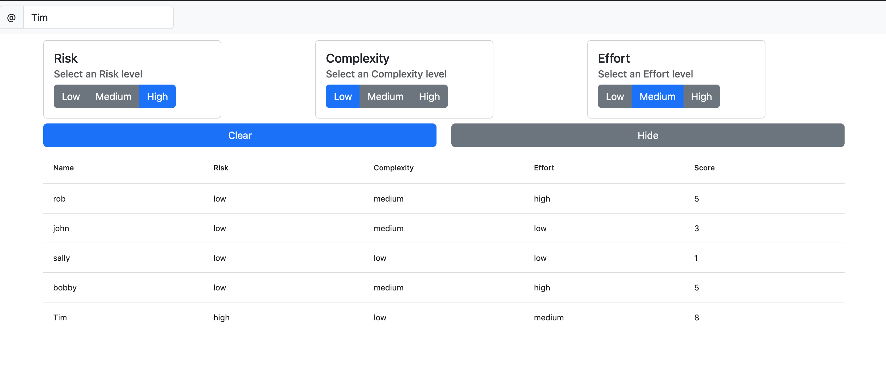

# Background

Provides a scrum poker like board for folks to estimate projects based on 3 categories (risk, complexity and effort) instead of just a fibonacci number alone. Also, because the scrum estimation board we currently use is sketchy and takes forever to load I wanted one of my own that's open source.

# DEMO 
# ACCESSING THE DEMO READ ME FIRST! PASSWORD!
Note: Password! To protect my site from whatever/robots you need to add ?password=lilpassword! on the end of the below:
Test site: https://estimations-test-board.netlify.app



In the project directory, you can run:

# Setup

## Install Dependencies (one time)
cd estimation && npm install
cd estimation/web-server && npm install

## Frontend:
export REACT_APP_BACKEND_URL=http://127.0.0.1:9000/
Note: REACT_APP_BACKEND_URL=<netlify_backend_url, see step below> 
cd estimation && npm start 
Example: export REACT_APP_BACKEND_URL=http://127.0.0.1:9000/ && npm start 

## Backend: (in another window)
cd estimation/web-server && npm run localbuild && npm run start

Runs the app in the development mode.\
Open [http://localhost:3000?password=<SEE ABOVE>](http://localhost:3000?password=<SEE ABOVE>) to view it in your browser.

The page will reload when you make changes.\
You may also see any lint errors in the console.

### Troubleshooting
If you get `opensslErrorStack` errors; you can get around this for now by using `export NODE_OPTIONS=--openssl-legacy-provider` before the npm commands

```opensslErrorStack: [ 'error:03000086:digital envelope routines::initialization error' ],
  library: 'digital envelope routines',
  reason: 'unsupported',
  code: 'ERR_OSSL_EVP_UNSUPPORTED'
```

# Backlog
1. Objective: Get the estimation board working locally
a. Get Effort working - DONE 
b. Be able to enter your name - DONE
c. Get clear working  - DONE 

2. Get the estimation board to work remotely for multiple users
- node.js with express running -DONE
- Gonna need a polling function - DONE
- Push the whole local user state (risk/effort/complexity) state up everytime. Only update your row with estimations. -- DONE 
- environment variables ! - DONE
- Fix refresh bug: (1) open app; enter new name "bobby" (2) enter a risk/effort (3) hit refresh... bobby is no longer the current user row... it's at the bottom and is uneditable - DONE
- data table - make columns sortable. - DONE

3. Fix usability and display issues
a. add some padding to the top and center all the things/fix spacing between clear and show button, add a background to the top row of the table - DONE
b. better png/card for hidden values. Better png/card for values not entered
c. Different png/display for hidden vs hidden and not entered - DONE
d. Disable the effort/risk/complexity buttons if the user has not put their username in && - // TODO: remove? how to handle if the user has not put in one of the three levels? -DONE
e. Updating username after the PUT creates a second username - DONE
f. My local user's estimations should always be visible to me - DONE
h. DONE Clear on user 1. User 2's values will not go away. Proposal: maintain a lastClearTimestamp on the local and the server. If the the value changes then clear the local user; setting everything to defaults
 - approach: have the backend maintain a timestamp: "lastClearTimestamp" and if the frontend gets an update updateFromBackend just check that 
    lastClearTimestmap !== the lastclearTimestamp on the server

4. TESTING!
- Edge cases: dont enter a username then click on effort/risk etc..., change username
- Edge case: username collisions
---- MVP ----
5. Allow for multiple boards
6. Address openssl-legacy-provider step in setup


# Tech/Debt Issue Backlog
1. "id" should be the key we use instead of name; makes updating easier. ( Make the id the identifier/primary key instead of the username)
2. Switch from CRA to vite! omg... when did that die...?
3. Typescript
4. linting/autoformatting
5. cors fixes


## Learn More

You can learn more in the [Create React App documentation](https://facebook.github.io/create-react-app/docs/getting-started).

To learn React, check out the [React documentation](https://reactjs.org/).